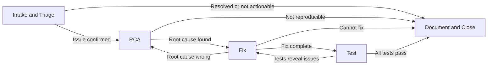

## What Is a Workflow?

A Workflow is a customizable, multi-stage pipeline that controls how a PlayerZero agent (a **Player**) processes work from start to finish. You define the stages, the allowed paths between them, and the rules that control progression.

When a Player enters a workflow, it moves through stages like **Intake & Triage → RCA → Fix → Test → Document & Close**. At each stage, the agent receives specific instructions, performs its work, and then requests permission to advance. Transitions can be auto-approved or gated behind human review.

---

## Core Concepts

### Stages

A stage is a node in the workflow graph. Each stage has a **name**, **instructions** that tell the agent what to do, a **type** (Entry, Work, or Terminal), and configuration for approvals and archival.

- **Entry** stages are where work begins
- **Work** stages are intermediate processing steps
- **Terminal** stages are where work concludes

### Transitions

Transitions are the allowed paths between stages. Each transition includes a target stage and conditions describing when the agent should take that path. Transitions are validated at runtime — the agent can only move to stages explicitly defined as valid next steps.

### Approvals

When the agent completes a stage, it requests a transition. Depending on configuration:

- **Auto-approve**: The agent moves immediately without human intervention
- **Manual approval**: A human reviews the work and approves the transition, optionally leaving notes for the agent

PlayerZero supports two approval modes:
- **Entry approval** (default): Approve the agent entering the next stage
- **Exit approval**: Approve the agent leaving the current stage — reframing the action as "I accept the work done here"

### Archival

Completed Players can be archived manually or automatically after a configurable number of days. Archived Players can be restored back to their previous stage if new input arrives.

---

## The Default Workflow

Every project starts with a five-stage defect resolution workflow:

| Stage | Type | Auto-approve | What Happens |
|---|---|---|---|
| **Intake & Triage** | Entry | Yes | Assess the issue, classify severity, gather context, check for known issues |
| **RCA** | Entry | Yes | Deep investigation — study codebase, generate hypotheses, run diagnostic simulations |
| **Fix** | Work | No | Implement a surgical fix, verify with simulations |
| **Test** | Work | No | Comprehensive QA — happy path, edge cases, regression, security |
| **Document & Close** | Terminal | No | Summarize the issue, document root cause and fix, capture learnings |

Triage and RCA auto-approve so the agent moves through them autonomously. Fix, Test, and Close require human approval — putting humans in the loop where high-stakes decisions happen.

---

## Two Surfaces

### The Workflow Builder

Design workflows using a visual drag-and-drop graph editor. Add stages, draw connections between them, configure transition rules, and export/import workflows across projects.

### The Workflow Inbox

Manage active work across your team. Filter by stage, approval status, ownership, and time range. Review Players inline and approve transitions without leaving the inbox.

---

## Get Started

- [Configuring Workflows](/features/configuring-workflows) — Set up stages, transitions, approvals, and archival
- [Workflow Examples](/features/workflow-examples) — Recipes and best practices for common patterns
